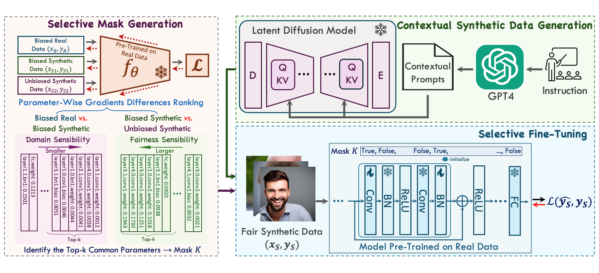

# AIM-Fair: Advancing Algorithmic Fairness via Selectively Fine-Tuning Biased Models with Contextual Synthetic Data

[](https://arxiv.org/abs/2503.05665) [](https://zengqunzhao.github.io/AIMFair)

*Zengqun Zhao, Ziquan Liu, Yu Cao, Shaogang Gong, and Ioannis Patras. **[AIM-Fair: Advancing Algorithmic Fairness via Selectively Fine-Tuning Biased Models with Contextual Synthetic Data](https://arxiv.org/abs/2503.05665)**, IEEE/CVF Conference on Computer Vision and Pattern Recognition (CVPR), 2025*

## Abstract

> Recent advances in generative models have sparked research on improving model fairness with AI-generated data. However, existing methods often face limitations in the diversity and quality of synthetic data, leading to compromised fairness and overall model accuracy. Moreover, many approaches rely on the availability of demographic group labels, which are often costly to annotate. This paper proposes AIM-Fair, aiming to overcome these limitations and harness the potential of cutting-edge generative models in promoting algorithmic fairness. We investigate a fine-tuning paradigm starting from a biased model initially trained on real-world data without demographic annotations. This model is then fine-tuned using unbiased synthetic data generated by a state-of-the-art diffusion model to improve its fairness. Two key challenges are identified in this fine-tuning paradigm, 1) the low quality of synthetic data, which can still happen even with advanced generative models, and 2) the domain and bias gap between real and synthetic data. To address the limitation of synthetic data quality, we propose Contextual Synthetic Data Generation (CSDG) to generate data using a text-to-image diffusion model (T2I) with prompts generated by a context-aware LLM, ensuring both data diversity and control of bias in synthetic data. To resolve domain and bias shifts, we introduce a novel selective fine-tuning scheme in which only model parameters more sensitive to bias and less sensitive to domain shift are updated. Experiments on CelebA and UTKFace datasets show that our AIM-Fair improves model fairness while maintaining utility, outperforming both fully and partially fine-tuned approaches to model fairness.

## Methods

<p align="center">
    
</p>

## Data Preparation

### True Data

Download the CelebA dataset from [this link](https://mmlab.ie.cuhk.edu.hk/projects/CelebA.html) and the UTKFace dataset from [this link](https://susanqq.github.io/UTKFace/)

### Synthetic Data

The image generation process is based on [Stable Difussion](https://github.com/Stability-AI/stablediffusion), located in the `./stable_diffusion`

We provide contextual prompts for image generation in `./stable_diffusion/scripts`

To generate balanced synthetic data, run: `./stable_diffusion/generation.sh`

Specify the target attribute and protected attribute using the `--target-sensitive` flag

## Model Training

To train the model, modify the `--real-data-path` and `--synthetic-data-root` arguments accordingly, then run: `runner.sh`

## Citation

If you find our work useful, please consider citing our paper:

```
@misc{zhao2025aimfairadvancingalgorithmicfairness,
  title={AIM-Fair: Advancing Algorithmic Fairness via Selectively Fine-Tuning Biased Models with Contextual Synthetic Data}, 
  author={Zengqun Zhao and Ziquan Liu and Yu Cao and Shaogang Gong and Ioannis Patras},
  year={2025},
  eprint={2503.05665},
  archivePrefix={arXiv},
  primaryClass={cs.CV},
  url={https://arxiv.org/abs/2503.05665}, 
}
```
